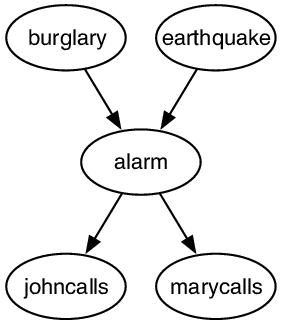
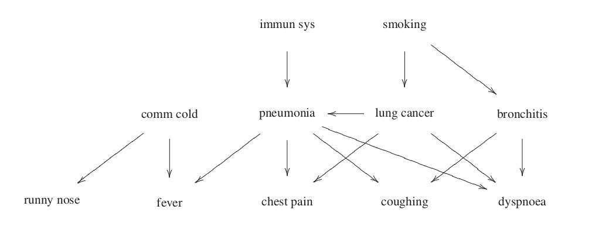

<<<<<<< HEAD
# Bayesian Classification
In this project, the case of **Bayesian Classification** is studied, which is a
specific type of classification procedure that utilizes **Bayes' theorem** in
order to assign labels to data, maximizing an appropriate posterior probability.

More specifically, we focus on **Bayesian Networks**, a type of probabilistic
graphical models that manages to model joint distributions of random variables. In particular, for the purposes
of this project, various inference algorithms regarding this type of graphical models are
implemented, such as **variable enumeration** and **prior sampling** as well as an 
algorithm that is used to induce such networks from a given training data set, called
**Chow-Liu**. All the above were used to build and test two different types of
Bayesian classifiers, **Naive Bayes** and **Tree Augmented Naive Bayes (TAN)**.

<!-- The structure of the two networks that are used in this project can be seen below.




 -->


In the ```*.json``` files under folder ```models/``` one can find the available networks that
can be used in the scope of this project. Note that each file contains the structure
as well as the **Conditional Probability Tables** of each network in a *json* format. These models are
used to implement the actual representation of each network, which is considered the ground truth.

Having built the aforementioned networks, **prior sampling** is  utilized in order to generate
an artificial dataset for each case; these are the datasets that are then used to train and
test the classifiers.

More details can be found in ```report/report.pdf``` and ```presentation/presentation.pdf```.

## Code
* ``main.py``: contains the driver code that is used to perform the experiments
  
* ``graph_utils.py``: contains the implementation of various graph operations (topological
sort, prim’s algorithm)
  
* ``bn_utils.py``: contains the implementation of a class named BayesianNetwork through
which the representation as well as the varibale enumeration algorithm are imple-
mented.

* ``bn_classifier.py``: contains the implementation of the class ``TANClassifier()`` through
which we implement the TAN as well as the Naive Bayes classifiers.
  
* ``bn_test.py``: contains code that calculates the classification error of a learnt network.
=======
# Bayesian Network Classifier
>>>>>>> 2bf0db0f90c3721337adf41826c3375946f985c3
